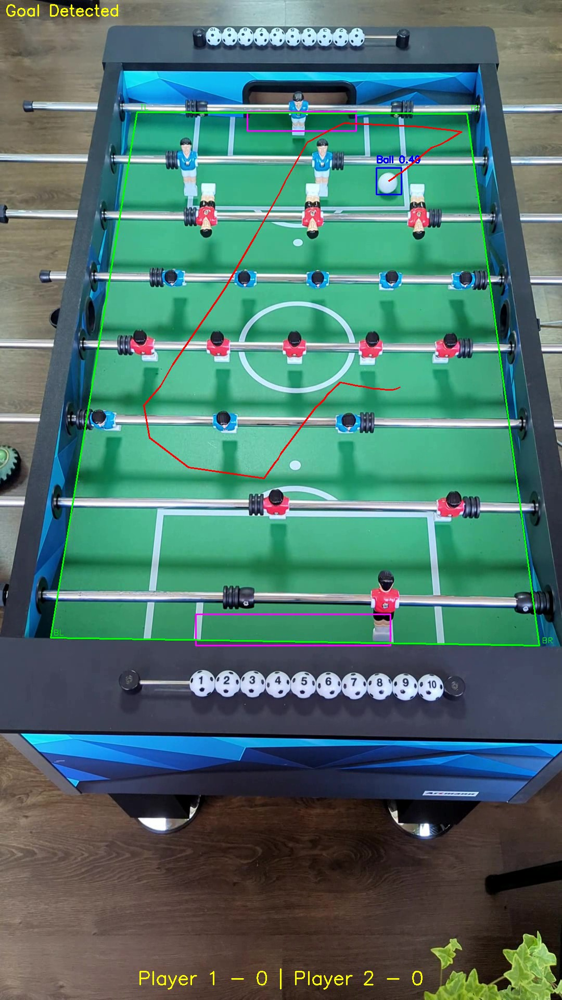

# Foosball tracker



This repository contains code for **Foosball tracking**

## Technology Stack

[](https://skillicons.dev)

- python
- opencv
- numpy
- ultralytics

## Authors:

- [Lev Kadatskyi](https://github.com/levkad03)
- [Denys Volkov](https://github.com/heroband)
- [Diana Koval](https://github.com/dihyidi)
- [Anton Kilmichenko](https://github.com/BroodCaster)

## Main Features:

- ball detection and tracking
- pitch detection
- goal detection

## How to run

- upload [this video](https://drive.google.com/file/d/1UH68RhZsxKn8eopYqneZJLtZXt3tHC-f/view) into `data` folder

- install dependencies

```bash
pip install -r requirements.txt
```

- run the script

```bash
python src/main.py
```